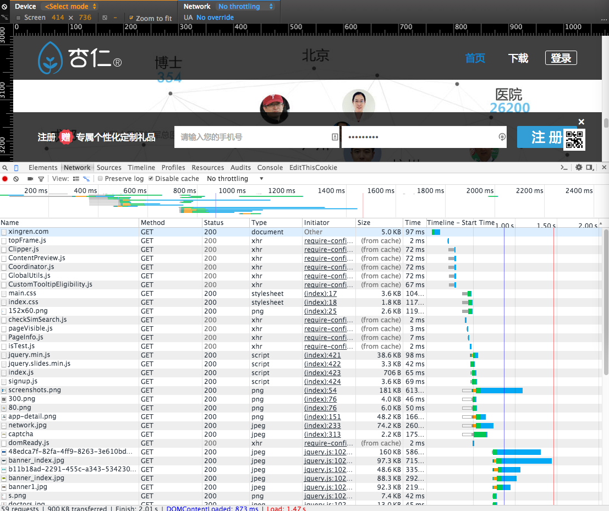

!SLIDE

# 杏仁的第一堂技术课

!SLIDE

}}} images/mars.jpg

# 来自火星的程序员GG

!SLIDE


!SLIDE

# 每次打开杏仁医生的网站或者APP时，到底发生了什么？

!SLIDE left

## 计算机程序

大型机：打孔卡片

单机程序：仙剑奇侠传，WinRAR

网络应用：传奇，QQ，杏仁医生

!SLIDE

## 杏仁医生的架构


!SLIDE

# 数据传输

!SLIDE left

## DNS

xingren.com -> 203.195.142.218

!SLIDE 

## HTTP


!SLIDE left

## 建立链接
Alice：你好，我是Alice。

Bob：你好，我是Bob。

Alice：好的。

!SLIDE left

## 传输数据

Alice：请给我xingren.com

Bob：BlahBlahBlah...

Alice：请给我xingren.com/main.css

Bob：BlahBlahBlah...

!SLIDE left

## 断开连接

Alice：我说完了。

Bob：我也说完了，我要挂了。

Alice：我也挂了。

!SLIDE left

## WebSocket

WebSocket是HTTP的一个扩展。

普通HTTP必须客户端发起请求，服务端应答；服务端不能主动发送数据给客户端。如果服务器有数据需要发送给客户端，只能通过轮询等方式处理。

WebSocket一旦建立连接，客户端和服务端就可以互相发送数据，从而达到实时交互的效果。

!SLIDE left

## SSL

确保Bob就是Alice要找的那个Bob，不是其他骗子。

确保通话的内容是加密的，其他人偷听到了也无法破译内容。

HTTPS就是加密的HTTP，WSS就是加密的WebSocket。

!SLIDE

# Web前端

!SLIDE 



!SLIDE left

# Web前端技术

语言：HTML/CSS/JavaScript 

图片等资源

Cookie

!SLIDE

## 编程语言就是给计算机的指令。


!SLIDE

## Ruby

```ruby
puts "Hello World"
```

!SLIDE

## Java

```java
public class HelloWord {
    public static void main(String[] args) {    
        System.out.println("hello world");
    }
}
```

!SLIDE 

## JavaScript

```Javascript
document.write("Hello, world!");
```

!SLIDE left


!SLIDE left


!SLIDE left

## 页面打开速度

影响页面打开速度的因素：

- 用户网络的带宽和延迟
- 请求数和页面大小
- JavaScript执行时间
- 服务器执行时间

网页打开每慢1秒，就有5%~10%的用户选择离开。

!SLIDE

## 移动网络的带宽和延迟


!SLIDE left

## 浏览器兼容

市场上有无数浏览器：IE、FireFox、Opera、Chrome、Safari、QQ、360等等等等。

不同的浏览器对HTML/CSS/JavaScript的实现有差别，特别是IE系列，于是产生了兼容问题。

曾经前端开发最痛苦的事情：兼容IE6。

!SLIDE left

## Cookie

HTTP请求是无状态的，阻碍了交互式Web应用程序的实现。

服务器可以向浏览器发送一段Cookie，下一次浏览器访问会把Cookie同时发给服务器。

Cookie的用途：用户登录、购物车、互联网广告、简单的首次访问判断等等。

!SLIDE

# 客户端APP

!SLIDE left

## 客户端APP的分类

iOS：Objective-C / Swift，使用XCode开发

Android：Java / C，使用Eclipse、IDEA等开发。

其他：塞班、Mac应用、Windows程序等

!SLIDE left

## 客户端APP的发布

iOS：

- 正规渠道：Apple App Store，需要审核（1-2周）。
- 企业版：立即发布，但有限制。
- 越狱渠道。

Android：应用宝、豌豆荚等各个应用商店。

!SLIDE left

## 客户端APP的数据

客户端APP从服务端获取的内容不是HTML等，而是特定格式的数据。

常用的数据格式就是JSON，例如：

```JavaScript
{
    "success": true ,
    "results": {
        "hasMore": true ,
        "objects": ["a", "b"]
    }
}
```

!SLIDE left

## 客户端App和Web页面的区别

客户端App：能直接使用各种原生的功能，性能更好体验更流畅。

Web App：能同时兼容iOS和Android，发布更及时更灵活。

!SLIDE left

## 杏仁医生是混合式的App

杏仁APP中，其实有很多页面是Web页面。比如：

- 各种活动页面如名医带班等
- 患教中心和随访模板中心等
- 诊疗记录和我的主页等

有些Web页面甚至是第三方的，比如UpToDate。

!SLIDE

# 服务端

!SLIDE left

## 服务端的任务

- 处理页面和客户端的Http请求，返回HTML或者格式化的数据。
- 处理客户端的WebSocket连接，及时推送数据给客户端。
- 处理定时任务，比如过期判断、日程提醒等。

杏仁的后台使用Scala开发的，也有少量Java代码。

!SLIDE left

## 服务端的环境

杏仁服务端有两套环境，测试环境和生产环境（即所有用户访问的环境）。两套环境的数据（包括用户）是分离的。

需要使用测试环境时：

- 如果是APP，需要使用测试版本的APP。
- 如果是Web页面只需要调整URL即可。测试环境的URL为 http://yisheng.aihaisi.com 和 http://xx.aihaisi.com 。

!SLIDE left

## 服务端的发布

把开发完成的功能更新到测试环境或者生产环境，这个过程叫做发布或者部署。

一般在发布到生产环境之前，会先发布到测试环境，由开发、QA等进行测试和验证。

杏仁生产环境目前有三台服务器，用户访问时会随机连接到其中一台。

!SLIDE left

## API

API（Application Programming Interface）就是应用程序之间的接口。

互联网应用通过开放API来实现各种互联，比如新浪开放平台、微信公众号等。

!SLIDE


!SLIDE left

## 通过微信

- 接受用户发的文本、图片、语音、视频、地理位置等信息；
- 接受用户菜单点击、关注、取消关注、扫描二维码等各种操作；
- 用户交互（指发送任意信息或者点击菜单）48小时内，给用户推送文本、图文等各种消息；
- 给用户发送指定格式的模板消息（不限制48小时）；
- 用户在微信内浏览页面，可以验证用户身份并拿到微信名、头像等基本信息；
- 支付、卡券、摇一摇等等等等；

!SLIDE left

## 其他第三方工具

微信支付/支付宝：付款。

腾讯COS/万象云图：处理我们的图片及其他文件。

JPush：处理消息通知。

友盟/OneAPM：统计各种数据和性能分析。

!SLIDE left

## 数据库

应用所有的数据都保存在数据库里面。数据库分为关系型数据库（MySQL等），非关系型数据库（MongoDB等）。最常用的就是关系型数据库。

关系型数据库由很多表组成，每个表其实就是一个有很多数据的超级Excel表，通过专用的SQL查询语言来查询表中的数据。

!SLIDE 

## 数据库表


一个简单的查询：

```Sql
select id, name, age from User where name='Bob'
```

!SLIDE

## 医院表


!SLIDE left

## 缓存

缓存无处不在：

- 页面缓存：浏览器会缓存页面、JS、CSS以及图片，避免重复下载。
- 数据缓存：后台会混存部分数据，避免每次都查询数据库。

缓存最大的问题是会带来不一致性。

!SLIDE

## 杏仁医生的架构


!SLIDE

# 程序员GG们是怎么开发杏仁医生的呢？

!SLIDE


!SLIDE

## 杏仁的开发流程


!SLIDE


!SLIDE left

## 如何提需求

提供需求动机、目标和优先级。

说明需求的业务细节（而非实现细节）。

避免需求频繁变更，及时反馈和沟通问题。

完成后及时验收确认，并提供反馈。

!SLIDE left

## 如何提BUG

要提供BUG出现的版本，系统等信息。

要清晰的描述BUG重现的步骤。

最好提供BUG出现的截图，登录账号等。

!SLIDE left

## 范例

不要这样：XX活动页面出错了！

要这样：

- 杏仁医生iOS 3.3.1版本
- 步骤：打开XX活动页面，在输入框输入XXX，点击确定。
- 结果：出现服务器错误的提示页面，截图见附件。
- 期望：参与活动成功，显示结果页面。


!SLIDE

## 技术的作用从短期来看往往被高估，但是从长期来看又往往容易被低估。

!SLIDE

# 谢谢!

